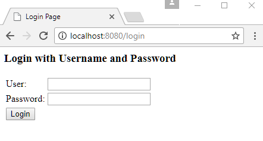
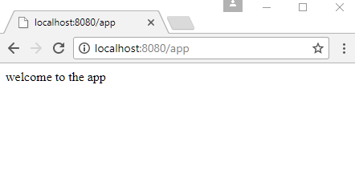
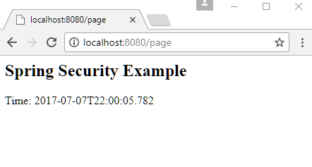

# Spring Security with Web MVC

In this example, we will learn how to use Spring security in a Spring Web MVC application. We will do in memory authentication of Spring security.

## Gradle dependencies

```gradle 

apply plugin: 'war'
apply plugin: 'eclipse-wtp'

war {
	baseName = 'mywebapp'
}

eclipse {
	wtp {
		component {
			contextPath = 'mywebapp'
		}
	}
}


sourceCompatibility = 1.8

repositories {
	mavenCentral()
}


dependencies {
	compile('org.springframework.security:spring-security-web:4.2.3.RELEASE')
	compile('org.springframework.security:spring-security-config:4.2.3.RELEASE')
	compile('org.springframework:spring-webmvc:4.3.9.RELEASE')
	compile('javax.servlet:javax.servlet-api:3.1.0')
}
```

## Java Config class

```java
@Configuration
@EnableWebSecurity
@EnableWebMvc
@ComponentScan
public class AppConfig extends WebSecurityConfigurerAdapter {

  @Override
  public void configure(AuthenticationManagerBuilder builder)
          throws Exception {
      builder.inMemoryAuthentication()
             .withUser("joe")
             .password("123")
             .roles("ADMIN");
  }

  @Bean
  public ViewResolver viewResolver() {
      InternalResourceViewResolver viewResolver = new InternalResourceViewResolver();
      viewResolver.setPrefix("/WEB-INF/views/");
      viewResolver.setSuffix(".jsp");
      return viewResolver;
  }
}
```

## DispatcherServlet initializer

```java
package com.logicbig.example;

import javax.servlet.ServletContext;
import javax.servlet.ServletException;
import javax.servlet.ServletRegistration;

import org.springframework.web.WebApplicationInitializer;
import org.springframework.web.context.support.AnnotationConfigWebApplicationContext;
import org.springframework.web.servlet.DispatcherServlet;

public class WebAppInitializer implements WebApplicationInitializer {

	@Override
	public void onStartup(ServletContext servletContext) throws ServletException {
		AnnotationConfigWebApplicationContext ctx = new AnnotationConfigWebApplicationContext();
		ctx.register(AppConfig.class);
		ctx.setServletContext(servletContext);
		
		ServletRegistration.Dynamic servlet = servletContext.addServlet("springDispatcherServlet", new DispatcherServlet(ctx));
		servlet.setLoadOnStartup(1);
		servlet.addMapping("/");
	}
}
```

## Initializing Security components

We still need to extend `AbstractSecurityWebApplicationInitializer` to initialize the security filter.

```java
public class SpringSecurityInitializer extends AbstractSecurityWebApplicationInitializer {
}
```

## A controller

```java
@Controller
public class ExampleController {
  @RequestMapping("/app")
  @ResponseBody
  public String handleRequest() {
      return "welcome to the app";
  }

  @RequestMapping("/page")
  public String handleRequest2(ModelMap map) {
      map.addAttribute("time", LocalDateTime.now().toString());
      return "my-page";
  }
}
```

## The JSP page

**src/main/webapp/WEB-INF/views/my-page.jsp**

```html
<html lang="en">
<body>
<h2>Spring Security Example</h2>
<p>Time: ${time}</p>
</body>
</html>
```

## Output

Accessing URI '/app' (Accessing any resource for the first time will show Spring authentication form):





