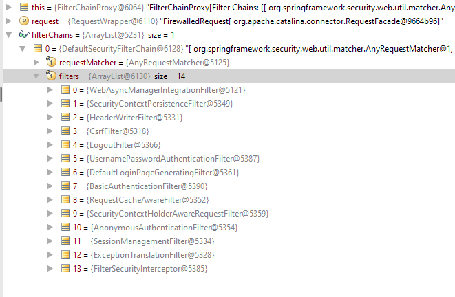

# Understanding Spring Security Configuration and Components

## AbstractSecurityWebApplicationInitializer

Normally, a secured web application using Spring Security would have a concrete implementation of `AbstractSecurityWebApplicationInitializer`, such as the following: 

```java
public class AppSecurityInitializer extends AbstractSecurityWebApplicationInitializer {
  public AppSecurityInitializer() {
      super(MyAppConfig.class);
  }
}
```

Because `AbstractSecurityWebApplicationInitializer` implements Spring's `WebApplicationInitializer`, `AppSecurityInitializer` will be initialized by [SpringServletContainerInitializer](../../../04-mvc/02-mvc-configuration/02-springservletcontainerinitializer/README.md) given that the spring-web module is on classpath.

The `onStartup()` method of this class, creates an instance of `AnnotationConfigWebApplicationContext` which registers client side `@Configuration` classes (`MyAppConfig` in the above example) and bootstraps Spring container.

In a Spring MVC application, the configuration class would be already registered via `DispatacherServlet`, it's not necessary to call `super(MyAppConfig.class)` in the above code. The following basic form would be sufficient.

```java
public class AppSecurityInitializer extends AbstractSecurityWebApplicationInitializer {
}
```

`AbstractSecurityWebApplicationInitializer` also registers an instance of [DelegatingFilterProxy](https://www.logicbig.com/tutorials/spring-framework/spring-web-mvc/delegating-filter-proxy.html). The value of `DelegatingFilterProxy#targetBeanName` property is set to `springSecurityFilterChain` which points to a bean imported by `@EnableWebSecurity`.

## @EnableWebSecurity

The configuration class would be annotated with this annotation as follows. 

```java
@Configuration
@EnableWebSecurity
public class MyAppConfig{
    ....
}
```

This annotation would import necessary Spring security configuration as detailed by the annotation definition below. 

```java
@Import({ WebSecurityConfiguration.class, SpringWebMvcImportSelector.class })
@EnableGlobalAuthentication
@Configuration
public @interface EnableWebSecurity {
 ....
}
```

This single annotation brings in `WebSecurityConfiguration` and `SpringWebMvcImportSelector` configuration classes, and `@EnableGlobalAutehtication`.

## WebSecurityConfiguration

`WebSecurityConfiguration` contains a `WebSecurity` which builds a `Filter` and registers it as a bean by the name of "springSecurityFilterChain". This filter is an instance of `FilterChainProxy`.
 
```java
@Configuration
public class WebSecurityConfiguration implements .... {
    ....
    private WebSecurity webSecurity;
    
    @Bean(name = AbstractSecurityWebApplicationInitializer.DEFAULT_FILTER_NAME)
    public Filter springSecurityFilterChain() throws Exception {
        boolean hasConfigurers = webSecurityConfigurers != null
                && !webSecurityConfigurers.isEmpty();
        if (!hasConfigurers) {
            WebSecurityConfigurerAdapter adapter = objectObjectPostProcessor
                    .postProcess(new WebSecurityConfigurerAdapter() {
                    });
            webSecurity.apply(adapter);
        }
        return webSecurity.build();
    }
    ....
}
```

As shown in the above snippet, the builder - `WebSecurity` applies customizations when building the FilterChainProxy. These customizations are carried by a collection of web security configurers that can be defined in our `MyAppConfig` and injected to this configuration. If no customization is found, a default `WebSecurityConfigurerAdapter` with no overridden method will be used.

### FilterChainProxy

This `Filter` bean is a proxy (within DelegatingFilterProxy) which delegates to a list of Spring-managed filter beans (they also implement `Filter` interface). Here's a list of those filters in a `FilterChainProxy` instance (spring security version 4.2.3.RELEASE):



Above screenshot is taken by setting a debug break point in `doFilter()` method of `FilterChainProxy` source code. We can apply some advance configurations or customizations on each of them.

### WebSecurity and HttpSecurity

`WebSecurity` is nothing but a builder to create an instance of `FilterChainProxy`. Its another sibling-class `HttpSecurity` allows configuring web based security for specific http requests. 

### WebSecurityConfigurerAdapter

`WebSecurityConfigurerAdapter` is implemented by the client application (usually by `@Configuration` class) to customize `WebSecurity` and/or `HttpSecurity`. It is an adapter implementation of `WebSecurityConfigurer`. Its `init()` method creates an instance of `HttpSecurity` which is responsible to add all the Filters in the screenshot above. 

## SpringWebMvcImportSelector

`@EnableWebSecurity` also imports `SpringWebMvcImportSelector` , which conditionally imports `WebMvcSecurityConfiguration` when the `DispatcherServlet` is present on the classpath.

This configuration class registers `RequestDataValueProcessor` bean which is used to provide data integrity, e.g. by protected against CSRF attacks.

## @EnableGlobalAuthentication

`@EnableWebSecurity` is also meta-annotated with `@EnableGlobalAuthentication` which imports `AuthenticationConfiguration`. This configuration register beans for authentication process.

With this import we can configure a global instance of `AuthenticationManagerBuilder`. For example:

```java
@Configuration
@EnableWebSecurity
public class MyAppConfig extends WebSecurityConfigurerAdapter {

  @Override
  public void configure(AuthenticationManagerBuilder builder)
          throws Exception {
      builder.inMemoryAuthentication()
             .withUser("joe")
             .password("123")
             .roles("ADMIN");
  }
  ........
}
```
