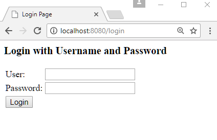
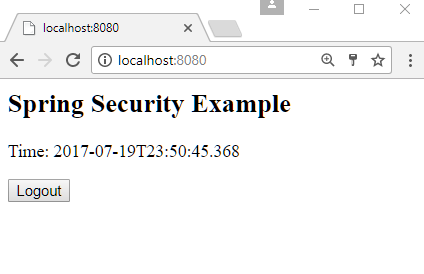
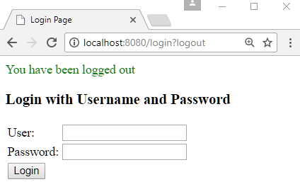

# How to log out with default configurations?

This example demonstrates how to automatically logout with default Spring security configuration.

To logout, we just need to access URL '/logout' with POST request.

In the POST /logout form, we also need to include the CSRF token, which is a protection against CSRF attack.

Let's see the example how to do that.

## Java Config class

```java
@Configuration
@EnableWebSecurity
@EnableWebMvc
@ComponentScan
public class AppConfig extends WebSecurityConfigurerAdapter {

  protected void configure(HttpSecurity http) throws Exception {
      http.authorizeRequests()
          .anyRequest().authenticated()
          .and()
          .formLogin();
  }

  @Override
  public void configure(AuthenticationManagerBuilder builder)
          throws Exception {
      builder.inMemoryAuthentication()
             .withUser("joe")
             .password("123")
             .roles("ADMIN");
  }

  @Bean
  public ViewResolver viewResolver() {
      InternalResourceViewResolver viewResolver = new InternalResourceViewResolver();
      viewResolver.setPrefix("/WEB-INF/views/");
      viewResolver.setSuffix(".jsp");
      return viewResolver;
  }
}
```

Note that, in above configuration, we are also overriding `configure(HttpSecurity http)` to omit the default Basic Authentication (see the original method in `WebSecurityConfigurerAdapter` source code) and use form based authentication. We are doing so because browsers (specially chrome) cache the Basic Authentication information aggressively (after the first successful login) and there is no way to logout the user in the current session. In most of the examples, we will not be using Basic Authentication mechanism.

## A controller

```java
@Controller
public class ExampleController {

  @RequestMapping("/")
  public String handleRequest2(ModelMap map) {
      map.addAttribute("time", LocalDateTime.now().toString());
      return "my-page";
  }
}
```

## The JSP page

**src/main/webapp/WEB-INF/views/my-page.jsp**

```html
<html lang="en">
<body>
 <h2>Spring Security Example</h2>
 <p>Time: ${time}</p>
  <form action="/logout" method="post">
     <input type="hidden"
            name="${_csrf.parameterName}"
            value="${_csrf.token}"/>
  <input type="submit" value="Logout">
</form>
</body>
</html>
```

## Output

Initial access to URI '/' will redirect to '/login':



After submitting user name and password as we setup in our AppConfig class:



Clicking on 'Logout' button:

