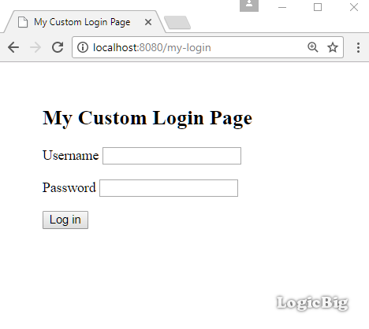
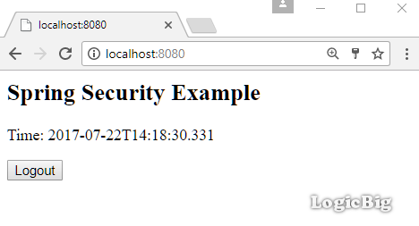
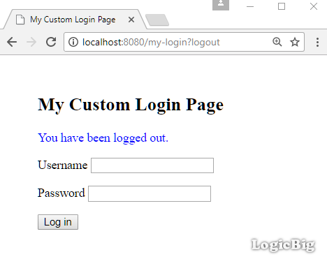

# Using a Custom Login Page

This example demonstrates how to use a custom login page.

## Java Config class

* We have to configure `HttpSecurity` to override the defaults. We are not going to replace the default handlers just the login URI.

* We have to set up `AuthenticationManager` with user, password and their roles.

* Map our custom login URI to the view by overriding `WebMvcConfigurerAdapter#addViewControllers()`.

```java
@Configuration
@EnableWebSecurity
@EnableWebMvc
@ComponentScan
public class AppConfig extends WebSecurityConfigurerAdapter {

  @Override
  protected void configure(HttpSecurity http) throws Exception {
      http.authorizeRequests()
          .anyRequest()//allow all urls
          .authenticated()//all URLs are allowed by any authenticated user, no role restrictions.
          .and()
          .formLogin()//enable form based authentication
          .loginPage("/my-login")//use a custom login URI
          .permitAll(true)//login URI can be accessed by anyone
          .and()
          .logout()//default logout handling
          .logoutSuccessUrl("/my-login?logout")//our new logout success url, we are not replacing other defaults.
          .permitAll();//allow all as it will be accessed when user is not logged in anymore

  }

  @Override
  public void configure(AuthenticationManagerBuilder builder)
          throws Exception {
      builder.inMemoryAuthentication()
             .withUser("joe")
             .password("123")
             .roles("ADMIN");
  }

  @Bean
  WebMvcConfigurer myWebMvcConfigurer() {
      return new WebMvcConfigurerAdapter() {

          @Override
          public void addViewControllers(ViewControllerRegistry registry) {
              ViewControllerRegistration r = registry.addViewController("/my-login");
              r.setViewName("my-login-page");
          }
      };
  }

  @Bean
  public ViewResolver viewResolver() {
      InternalResourceViewResolver viewResolver = new InternalResourceViewResolver();
      viewResolver.setPrefix("/WEB-INF/views/");
      viewResolver.setSuffix(".jsp");
      return viewResolver;
  }
}
```

## A Controller

```java
@Controller
public class ExampleController {

  @RequestMapping("/")
  public String handleRequest2(ModelMap map) {
      map.addAttribute("time", LocalDateTime.now().toString());
      return "my-page";
  }
}
```

## The JSP pages

**src/main/webapp/WEB-INF/views/my-login-page.jsp**

```jsp
<%@ taglib prefix="c" uri="http://java.sun.com/jsp/jstl/core"%>
<html>
<head>
<title>My Custom Login Page</title>
</head>
<body style='margin:50px;'>
  <h2>My Custom Login Page</h2>
  <form action="/my-login" method="post">
    	<c:if test="${param.error != null}">
    		<p style='color:red'>
    			Invalid username and password.
    		</p>
    	</c:if>
    	<c:if test="${param.logout != null}">
    		<p style='color:blue'>
    			You have been logged out.
    		</p>
    	</c:if>
    	<p>
    		<label for="username">Username</label>
    		<input type="text" id="username" name="username"/>
    	</p>
    	<p>
    		<label for="password">Password</label>
    		<input type="password" id="password" name="password"/>
    	</p>
    	<input type="hidden"
    		name="${_csrf.parameterName}"
    		value="${_csrf.token}"/>
    	<button type="submit">Log in</button>
    </form>
</body>
</html>
```

**src/main/webapp/WEB-INF/views/my-page.jsp**

```html
<%@ taglib prefix="c" uri="http://java.sun.com/jsp/jstl/core"%>
<html lang="en">
<body>
 <h2>Spring Security Example</h2>
 <p>Time: ${time}</p>
  <form action="/logout" method="post">
     <input type="hidden"
            name="${_csrf.parameterName}"
            value="${_csrf.token}"/>
  <input type="submit" value="Logout">
</form>
</body>
</html>
```

## Output

Initial access to URI '/' will redirect to '/my-login':



After submitting user name and password as we setup in our AppConfig class:



Clicking on 'Logout' button:

