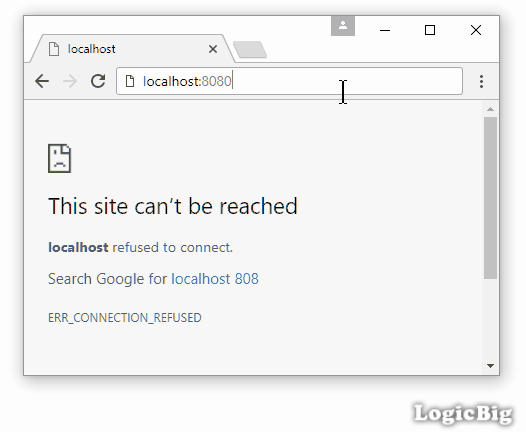

# Configuring HttpSecurity

This example demonstrates how to customize authorization configuration.

By default following configuration is setup in the `WebSecurityConfigurerAdapter` class which grants authenticated users (all roles) to access all URLs.

```java
public abstract class WebSecurityConfigurerAdapter implements ....{
    .........
  protected void configure(HttpSecurity http) throws Exception {
    http.authorizeRequests()
        .anyRequest().authenticated()
        .and()
        .formLogin()
        .and()
        .httpBasic();
  }
    ........
}
```

Let's see how to customize above settings by overriding the `configure()` method:

## Java Config class

```java
@Configuration
@EnableWebSecurity
@EnableWebMvc
@ComponentScan
public class AppConfig extends WebSecurityConfigurerAdapter {

  @Override
  protected void configure(HttpSecurity http) throws Exception {
      http.authorizeRequests()
          .antMatchers("/users/**").hasRole("USER")//USER role can access /users/**
          .antMatchers("/admin/**").hasRole("ADMIN")//ADMIN role can access /admin/**
          .antMatchers("/quests/**").permitAll()// anyone can access /quests/**
          .anyRequest().authenticated()//any other request just need authentication
          .and()
          .formLogin();//enable form login

  }

  @Override
  public void configure(AuthenticationManagerBuilder builder)
          throws Exception {
      builder.inMemoryAuthentication()
             .withUser("tim").password("123").roles("ADMIN")
             .and()
             .withUser("joe").password("234").roles("USER");
  }

  @Bean
  public ViewResolver viewResolver() {
      InternalResourceViewResolver viewResolver = new InternalResourceViewResolver();
      viewResolver.setPrefix("/WEB-INF/views/");
      viewResolver.setSuffix(".jsp");
      return viewResolver;
  }
}
```

## The Controller

```java
@Controller
public class MyController {

  @RequestMapping("/**")
  public String handleRequest2(HttpServletRequest request, Model model) {
      Authentication auth = SecurityContextHolder.getContext()
                                                 .getAuthentication();
      model.addAttribute("uri", request.getRequestURI())
           .addAttribute("user", auth.getName())
           .addAttribute("roles", auth.getAuthorities());
      return "my-page";
  }
}
```

## The JSP page

**src/main/webapp/WEB-INF/views/my-page.jsp**

```jsp
<%@ taglib prefix="c" uri="http://java.sun.com/jsp/jstl/core"%>
<html lang="en">
<body>
 <p>URI: ${uri} <br/>
 User :  ${user} <br/>
 roles:  ${roles} <br/><br/>
 <a href="/admin/">/admin/</a><br/>
 <a href="/users/">/users/</a><br/>
 <a href="/others/">/others/</a><br/>
 <a href="/quests/">/quests/</a><br/><br/>
 </p>
 <form action="/logout" method="post">
     <input type="hidden"
            name="${_csrf.parameterName}"
            value="${_csrf.token}"/>
  <input type="submit" value="Logout">
</form>
</body>
</html>
```

According to above configurations and as links placed in the JSP page:

* 'tim' can access '/admin/**', '/others/**' and '/quests/**'.

* 'joe' can access '/users/**', '/others/**' and '/quests/**'

* A logged out user can only access '/quests/**'.

## Output

