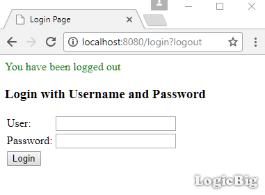

# JDBC Authentication

JDBC based authentication stores the authentication information in a database. In this example, we will use H2 data source and will provide user authentication information via Java config.

## Java Config class

```java
@Configuration
@EnableWebSecurity
@EnableWebMvc
@ComponentScan
public class AppConfig extends WebSecurityConfigurerAdapter {

  @Bean
  public DataSource appDataSource() {
      return new EmbeddedDatabaseBuilder()
              .setType(EmbeddedDatabaseType.H2)
              .build();
  }

  @Override
  protected void configure(HttpSecurity http) throws Exception {
      http.authorizeRequests()
          .anyRequest().authenticated()
          .and()
          .formLogin();
  }

  @Override
  public void configure(AuthenticationManagerBuilder builder)
          throws Exception {
      builder.jdbcAuthentication()
             .dataSource(appDataSource())
             .withDefaultSchema()
             .withUser("tina").password("222").roles("ADMIN")
             .and()
             .withUser("tom").password("444").roles("ADMIN");
  }

  @Bean
  public ViewResolver viewResolver() {
      InternalResourceViewResolver viewResolver = new InternalResourceViewResolver();
      viewResolver.setPrefix("/WEB-INF/views/");
      viewResolver.setSuffix(".jsp");
      return viewResolver;
  }
}
```

In above configuration, we are setting up embedded H2 database as the data source (by default in memory H2 database will be used). We are also configuring JDBC authentication, which will generate a default 'User' schema and populate the tables with the provided users information.

## The generated database schema

Let's look at what tables are generated during startup:

```java
@Component
public class MyContextRefreshListener {
  @Autowired
  private DataSource appDataSource;

  @EventListener
  public void handleContextRefresh(ContextRefreshedEvent event) {
      System.out.println("-- Context Refreshed --");
      JdbcTemplate jdbcTemplate = new JdbcTemplate(appDataSource);
      execSql(jdbcTemplate, "SHOW TABLES");
      execSql(jdbcTemplate, "Select * from USERS");
      execSql(jdbcTemplate, "Select * from AUTHORITIES");
  }

  public static void execSql(JdbcTemplate jdbcTemplate, String sql) {
      System.out.printf("'%s'%n", sql);
      jdbcTemplate.query(sql, new RowCallbackHandler() {
          @Override
          public void processRow(ResultSet rs) throws SQLException {
              System.out.println();
              ResultSetMetaData metadata = rs.getMetaData();
              int columnCount = metadata.getColumnCount();
              for (int i = 1; i <= columnCount; i++) {
                  String columnName = metadata.getColumnName(i);
                  Object object = rs.getObject(i);
                  System.out.printf("%s = %s%n", columnName, object);
              }
          }
      });
      System.out.println("------------------");
  }
}
```

The [default schema](https://docs.spring.io/spring-security/site/docs/current/reference/html/appendix-schema.html#user-schema) contains two tables `USERS` and `AUTHORITIES`.

## The Controller

```java
@Controller
public class MyController {

  @RequestMapping("/**")
  public String handleRequest2(HttpServletRequest request, Model model) {
      Authentication auth = SecurityContextHolder.getContext()
                                                 .getAuthentication();
      model.addAttribute("uri", request.getRequestURI())
           .addAttribute("user", auth.getName())
           .addAttribute("roles", auth.getAuthorities())
           .addAttribute("time", LocalTime.now());
      return "my-page";
  }
}
```

## The JSP page

**src/main/webapp/WEB-INF/views/my-page.jsp**

```jsp
<%@ taglib prefix="c" uri="http://java.sun.com/jsp/jstl/core"%>
<html lang="en">
<body>
 <h2>Spring Security Example</h2>
 <p>Time: ${time}<br/>
  <p>URI: ${uri} <br/>
  User :  ${user} <br/>
  roles:  ${roles} <br/>
  </p>
  <form action="/logout" method="post">
     <input type="hidden"
            name="${_csrf.parameterName}"
            value="${_csrf.token}"/>
  <input type="submit" value="Logout">
</form>
</body>
</html>
```

## Output

During startup, following is logged on the server console:

```apache
-- Context Refreshed --
'SHOW TABLES'

TABLE_NAME = AUTHORITIES
TABLE_SCHEMA = PUBLIC

TABLE_NAME = USERS
TABLE_SCHEMA = PUBLIC
------------------
'Select * from USERS'

USERNAME = tina
PASSWORD = 222
ENABLED = true

USERNAME = tom
PASSWORD = 444
ENABLED = true
------------------
'Select * from AUTHORITIES'

USERNAME = tina
AUTHORITY = ROLE_ADMIN

USERNAME = tom
AUTHORITY = ROLE_USER
------------------
```

Accessing 'http://localhost:8080/' from browser:


Submitting user/password:


Logging out:

