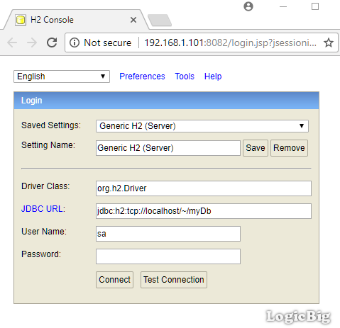
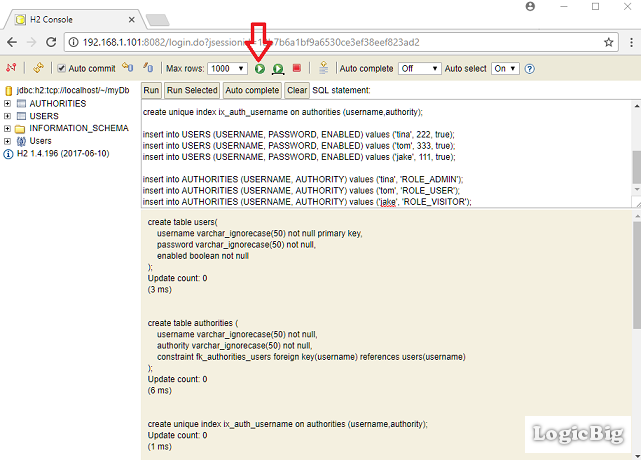

# JDBC Authentication with remote Database running in server mode

This example demonstrates how to implement Spring JDBC authentication with remote database server. Even though we are going to use H2 database, these steps should work for any database with related JDBC driver and valid server URL.

## Downloading H2 database and running in server mode

Download H2 database from [here](http://www.h2database.com/html/main.html) (the zip file). Extract the zip file (say at location c:\). The main folder h2-xxx will be created (h2-2017-06-10 in my case). Run the following from command line:

```shell
C:\h2-2017-06-10\h2\bin\h2.bat
```

That will open the h2 console in browser. Apply the settings as shown:



Click on 'Connect' button. It will take you the schema user interface.

Now copy/paste the following script (User Schema and insert statements) in the 'SQL Statement' section as shown:

**src/main/resources/schema.sql**

```sql
create table users(
	username varchar_ignorecase(50) not null primary key,
	password varchar_ignorecase(50) not null,
	enabled boolean not null
);

create table authorities (
	username varchar_ignorecase(50) not null,
	authority varchar_ignorecase(50) not null,
	constraint fk_authorities_users foreign key(username) references users(username)
);

create unique index ix_auth_username on authorities (username,authority);

insert into USERS (USERNAME, PASSWORD, ENABLED) values ('tina', 222, true);
insert into USERS (USERNAME, PASSWORD, ENABLED) values ('tom', 333, true);
insert into USERS (USERNAME, PASSWORD, ENABLED) values ('jake', 111, true);

insert into AUTHORITIES (USERNAME, AUTHORITY) values ('tina', 'ROLE_ADMIN');
insert into AUTHORITIES (USERNAME, AUTHORITY) values ('tom', 'ROLE_USER');
insert into AUTHORITIES (USERNAME, AUTHORITY) values ('jake', 'ROLE_VISITOR');
```

Paste the script here and click on the run button:



Above standard sql statements should work for all databases, if not then you may need to tweak it a little for your database.

You can play a little here to see whether AUTHORITIES and USERS tables are created and populated as expected.

## Creating example application

### Java Config class

```java
@Configuration
@EnableWebSecurity
@EnableWebMvc
@ComponentScan
public class AppConfig extends WebSecurityConfigurerAdapter {

  @Bean
  public DataSource appDataSource() {
      DriverManagerDataSource ds = new DriverManagerDataSource();
      ds.setDriverClassName(org.h2.Driver.class.getName());
      ds.setUrl("jdbc:h2:tcp://localhost/~/myDb");
      ds.setUsername("sa");
      ds.setPassword("");
      return ds;
  }

  @Override
  protected void configure(HttpSecurity http) throws Exception {
      http.authorizeRequests()
          .anyRequest().authenticated()
          .and()
          .formLogin();
  }

  @Override
  public void configure(AuthenticationManagerBuilder builder)
          throws Exception {
      builder.jdbcAuthentication()
             .dataSource(appDataSource());
  }

  @Bean
  public ViewResolver viewResolver() {
      InternalResourceViewResolver viewResolver = new InternalResourceViewResolver();
      viewResolver.setPrefix("/WEB-INF/views/");
      viewResolver.setSuffix(".jsp");
      return viewResolver;
  }
}
```

Depending on what database you are using, you have to specify the related JDBC driver and correct URL for your database.

### The Controller

```java
@Controller
public class MyController {

  @RequestMapping("/**")
  public String handleRequest2(HttpServletRequest request, Model model) {
      Authentication auth = SecurityContextHolder.getContext()
                                                 .getAuthentication();
      model.addAttribute("uri", request.getRequestURI())
           .addAttribute("user", auth.getName())
           .addAttribute("roles", auth.getAuthorities())
           .addAttribute("time", LocalTime.now());
      return "my-page";
  }
}
```

### The JSP page

**src/main/webapp/WEB-INF/views/my-page.jsp**

```jsp
<%@ taglib prefix="c" uri="http://java.sun.com/jsp/jstl/core"%>
<html lang="en">
<body>
 <h2>Spring Security Example</h2>
 <p>Time: ${time}<br/>
    URI: ${uri} <br/>
    User :  ${user} <br/>
    roles:  ${roles} <br/>
  </p>
  <form action="/logout" method="post">
     <input type="hidden"
            name="${_csrf.parameterName}"
            value="${_csrf.token}"/>
  <input type="submit" value="Logout">
</form>
</body>
</html>
```