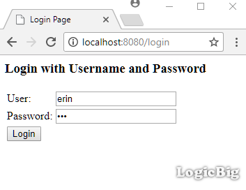
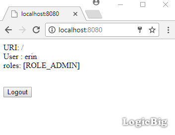
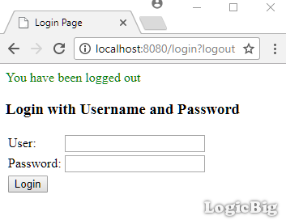
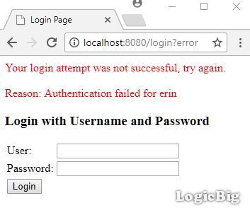

# Understanding AuthenticationProvider and creating a custom one

An `AuthenticationProvider` implementation takes care of verifying an authentication request.

By default Spring Security uses `ProviderManager` class which delegates to a list of configured AuthenticationProvider(s), each of which is queried to see if it can perform the authentication.

Depending on our configuration that we provide by overriding `WebSecurityConfigurerAdapter#configure(AuthenticationManagerBuilder builder)`, specific AuthenticationProviders are used.

## The AuthenticationProvider interface

```java
package org.springframework.security.authentication;
 ....
public interface AuthenticationProvider {
    Authentication authenticate(Authentication authentication) throws AuthenticationException;
    boolean supports(Class<?> authentication);
}
```

The method `authenticate()` performs authentication and returns a fully authenticated object including credentials. It may return null if the `AuthenticationProvider` is unable to support authentication of the passed `Authentication` object. In such a case, the next `AuthenticationProvider` that supports the presented `Authentication` class will be attempted.

The method `supports()` returns true if this `AuthenticationProvider` supports the indicated `Authentication` object


This example will demonstrate how to create and register a custom `AuthenticationProvider`.

## Creating AuthenticationProvider

```java
public class CustomAuthenticationProvider implements AuthenticationProvider {
    private static List<User> users = new ArrayList();

    public CustomAuthenticationProvider() {
        users.add(new User("erin", "123", "ROLE_ADMIN"));
        users.add(new User("mike", "234", "ROLE_ADMIN"));
    }

    @Override
    public Authentication authenticate(Authentication authentication)
            throws AuthenticationException {
        String name = authentication.getName();
        Object credentials = authentication.getCredentials();
        System.out.println("credentials class: " + credentials.getClass());
        if (!(credentials instanceof String)) {
            return null;
        }
        String password = credentials.toString();

        Optional<User> userOptional = users.stream()
                                           .filter(u -> u.match(name, password))
                                           .findFirst();

        if (!userOptional.isPresent()) {
            throw new BadCredentialsException("Authentication failed for " + name);
        }

        List<GrantedAuthority> grantedAuthorities = new ArrayList<>();
        grantedAuthorities.add(new SimpleGrantedAuthority(userOptional.get().role));
        Authentication auth = new
                UsernamePasswordAuthenticationToken(name, password, grantedAuthorities);
        return auth;
    }

    @Override
    public boolean supports(Class<?> authentication) {
        return authentication.equals(UsernamePasswordAuthenticationToken.class);
    }

    private static class User {
        private String name;
        private String password;
        private String role;

        public User(String name, String password, String role) {
            this.name = name;
            this.password = password;
            this.role = role;
        }

        public boolean match(String name, String password) {
            return this.name.equals(name) && this.password.equals(password);
        }
    }
}
```

## Java Config class

```java
@Configuration
@EnableWebSecurity
@EnableWebMvc
@ComponentScan
public class AppConfig extends WebSecurityConfigurerAdapter {

  @Override
  protected void configure(HttpSecurity http) throws Exception {
      http.authorizeRequests()
          .antMatchers("/**").hasRole("ADMIN")
          .anyRequest()
          .authenticated()
          .and()
          .formLogin();
  }

  @Override
  public void configure(AuthenticationManagerBuilder builder)
          throws Exception {
      builder.authenticationProvider(new CustomAuthenticationProvider());
  }

  @Bean
  public ViewResolver viewResolver() {
      InternalResourceViewResolver viewResolver = new InternalResourceViewResolver();
      viewResolver.setPrefix("/WEB-INF/views/");
      viewResolver.setSuffix(".jsp");
      return viewResolver;
  }
}
```

In above example, we are using `AuthenticationManagerBuilder` by overriding `WebSecurityConfigurerAdapter#configure`. Alternatively, we can register our `CustomAuthenticationProvider` as bean either by using `@Bean` or `@Component`.

## The Controller

```java
@Controller
public class MyController {

  @RequestMapping("/**")
  public String handleRequest2(HttpServletRequest request, Model model) {
      Authentication auth = SecurityContextHolder.getContext()
                                                 .getAuthentication();
      model.addAttribute("uri", request.getRequestURI())
           .addAttribute("user", auth.getName())
           .addAttribute("roles", auth.getAuthorities());
      return "my-page";
  }
}
```

## The JSP page

**src/main/webapp/WEB-INF/views/my-page.jsp**

```jsp
<html lang="en">
<body>
 <p>URI: ${uri} <br/>
 User :  ${user} <br/>
 roles:  ${roles} <br/><br/>
 </p>
 <form action="/logout" method="post">
     <input type="hidden"
            name="${_csrf.parameterName}"
            value="${_csrf.token}"/>
  <input type="submit" value="Logout">
</form>
</body>
</html>
```

## Output

Entering the credential:





Logging out:



Entering wrong credentials:

