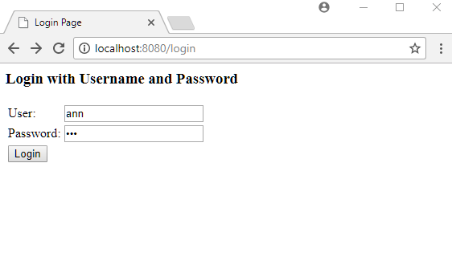
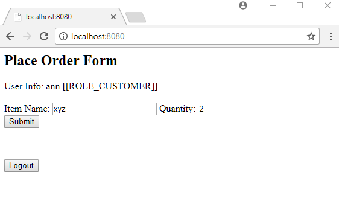
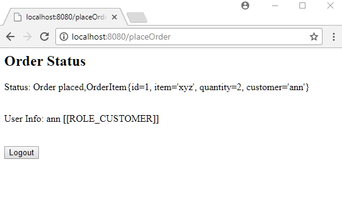
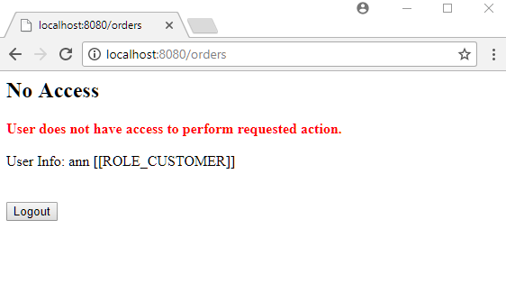

# Securing Service Layer Methods with @Secured Annotation

This example demonstrates how to implement method level security by using `@Secured` annotation. With this annotation, we can specify the roles that can access the target method. If logged-in user does not have the specified role and the target method is invoked then an 'access denied' page is returned.

## Service layer

```java
public interface ShoppingCartService {
    @Secured("ROLE_CUSTOMER")
    int placeOrder(OrderItem order);

    @Secured("ROLE_ADMIN")
    List<OrderItem> getOrderList();
}
@Service
public class ShoppingCartServiceImpl implements ShoppingCartService {
    private List<OrderItem> orderItems = new ArrayList<>();

    @Override
    public int placeOrder(OrderItem order) {
        int id = orderItems.size() + 1;
        order.setId(id);
        orderItems.add(order);
        return id;
    }

    @Override
    public List<OrderItem> getOrderList() {
        return orderItems;
    }
}
```

## Java Config class

```java
@Configuration
@EnableWebSecurity
@EnableWebMvc
@ComponentScan
@EnableGlobalMethodSecurity(securedEnabled = true)
public class AppConfig extends WebSecurityConfigurerAdapter {

  protected void configure(HttpSecurity http) throws Exception {
      http.authorizeRequests()
          .anyRequest().authenticated()
          .and()
          .formLogin()
          .and()
          .exceptionHandling().accessDeniedPage("/noAccess");
  }

  @Override
  public void configure(AuthenticationManagerBuilder builder)
          throws Exception {
      builder.inMemoryAuthentication()
             .withUser("ann").password("123").roles("CUSTOMER")
             .and()
             .withUser("ray").password("234").roles("ADMIN");
  }

  @Bean
  public ViewResolver viewResolver() {
      InternalResourceViewResolver viewResolver = new InternalResourceViewResolver();
      viewResolver.setPrefix("/WEB-INF/views/");
      viewResolver.setSuffix(".jsp");
      return viewResolver;
  }
}
```

Note that, we used the annotation `@EnableGlobalMethodSecurity` and enabled `@Secured` annotation by specifying `securedEnabled = true`.

In above configuration, we also specified a custom `accessDeniedPage` page (see `configure(HttpSecurity http)` method), which will be returned if a method without access permission is invoked. Without this configuration, a default error page is returned.

## A Controller

```java
@Controller("/")
public class ShoppingCartController {
  @Autowired
  private ShoppingCartService shoppingCartService;

  @GetMapping
  public String placeOrderPage(Model model) {
      addUserInfo(model);
      return "place-order";
  }

  @RequestMapping("/noAccess")
  public String noAccess(Model model) {
      addUserInfo(model);
      return "no-access";
  }

  @RequestMapping(value = "placeOrder", method = RequestMethod.POST)
  public String addOrderItem(OrderItem orderItem, Model model) {
      Authentication auth = SecurityContextHolder.getContext()
                                                 .getAuthentication();
      orderItem.setCustomer(auth.getName());
      shoppingCartService.placeOrder(orderItem);
      model.addAttribute("status", "Order placed," + orderItem);
      addUserInfo(model);
      return "order-status";
  }

  @RequestMapping(value = "orders", method = RequestMethod.GET)
  public String getOrderItemList(Model model) {
      addUserInfo(model);
      model.addAttribute("orderList",
              shoppingCartService.getOrderList().toString());
      return "order-list";
  }

  private void addUserInfo(Model model) {
      Authentication auth = SecurityContextHolder.getContext()
                                                 .getAuthentication();
      model.addAttribute("userInfo",
              String.format("%s [%s]", auth.getName(), auth.getAuthorities()));
  }
}
```

## The JSP pages

**src/main/webapp/WEB-INF/views/place-order.jsp**

```jsp
<html lang="en">
<body>
 <h2>Place Order Form</h2>
 <div>User Info: ${userInfo}</div>
 <br/>
<form action="placeOrder" method="post" >
Item Name:  <input type="text" name="item" />
Quantity: <input type="text" name="quantity" /><br/>
 <input type="hidden"
            name="${_csrf.parameterName}"
            value="${_csrf.token}"/>
  <input type="submit" value="Submit" />
</form>
<br/><br/>
  <form action="/logout" method="post">
     <input type="hidden"
            name="${_csrf.parameterName}"
            value="${_csrf.token}"/>
  <input type="submit" value="Logout">
</form>
</body>
</html>
```

**src/main/webapp/WEB-INF/views/order-status.jsp**

```jsp
<html lang="en">
<body>
 <h2>Order Status</h2>
 <p>Status: ${status}</p>
 <br/>
 <div>User Info: ${userInfo}</div>
<br/>
 <br/>
  <form action="/logout" method="post">
     <input type="hidden"
            name="${_csrf.parameterName}"
            value="${_csrf.token}"/>
  <input type="submit" value="Logout">
</form>
</body>
</html>
```

**src/main/webapp/WEB-INF/views/order-list.jsp**

```jsp
<html lang="en">
<body>
<h2>Order List</h2>

<div> ${orderList}</div>

<br/><br/>
<div>User Info: ${userInfo}</div>
<form action="/logout" method="post">
    <input type="hidden"
           name="${_csrf.parameterName}"
           value="${_csrf.token}"/>
    <input type="submit" value="Logout">
</form>
</body>
</html>
```

**src/main/webapp/WEB-INF/views/no-access.jsp**

```jsp
<html lang="en">
<body>
<h2>No Access</h2>
<b style="color:red">User does not have access to perform requested action.</b>
<br/><br/>
<div>User Info: ${userInfo}</div>
<br/>
<br/>
<form action="/logout" method="post">
    <input type="hidden"
           name="${_csrf.parameterName}"
           value="${_csrf.token}"/>
    <input type="submit" value="Logout">
</form>
</body>
</html>
```

## Output

Enter URL 'http://localhost:8080/' and log in with user 'ann':



Submit an order



Now manually enter 'http:/localhost:8080/orders'. This will invoke `ShoppingCartService#getOrderList()`. As 'ann' does not have the ADMIN role, access will be denied:



Now logging out and logging in with user 'ray' (who has the ADMIN role), we can access the '/orders' but we cannot place order as `ShoppingCartService#placeOrder()` method is only allowed for the CUSTOMER role.

