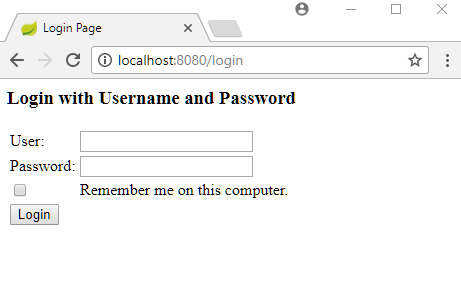
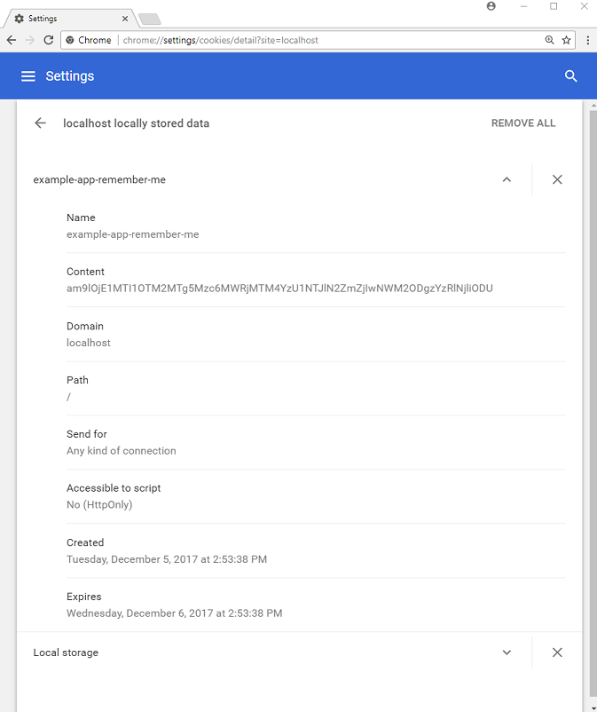

# Basic Remember-Me Authentication using TokenBasedRememberMeServices

<p color="red"><b>Note</b>: This example works with the following combination:</p>

```gradle
dependencies {
	compile('org.springframework.security:spring-security-web:4.2.3.RELEASE')
	compile('org.springframework.security:spring-security-config:4.2.3.RELEASE')
	compile('org.springframework:spring-webmvc:4.3.9.RELEASE')
	providedCompile('javax.servlet:javax.servlet-api:3.1.0')
}
```

Following example shows how to implement remember-me feature in web based authentication. Spring Security uses an implementation of `RememberMeServices` to provide the remember-me functionality.

There are two implementations of this interface: `TokenBasedRememberMeServices` (uses Base-64 encoded cookie, simple to use but not very secure) and `PersistentTokenBasedRememberMeServices` (persistent Token approach, uses a database table). Following example will show how to use first one i.e. `TokenBasedRememberMeServices`.

## Java Config class

```java
@Configuration
@EnableWebSecurity
@EnableWebMvc
@ComponentScan
public class AppConfig extends WebSecurityConfigurerAdapter {

  protected void configure(HttpSecurity http) throws Exception {
      http.authorizeRequests()
          .anyRequest().authenticated()
          .and()
          .formLogin()
          .and()
          .rememberMe()
          .rememberMeCookieName("example-app-remember-me")
          .tokenValiditySeconds(24 * 60 * 60);
  }

  @Override
  public void configure(AuthenticationManagerBuilder builder)
          throws Exception {
      builder.inMemoryAuthentication()
             .withUser("joe")
             .password("123")
             .roles("ADMIN");
  }

  @Bean
  public ViewResolver viewResolver() {
      InternalResourceViewResolver viewResolver = new InternalResourceViewResolver();
      viewResolver.setPrefix("/WEB-INF/views/");
      viewResolver.setSuffix(".jsp");
      return viewResolver;
  }
}
```

By default `rememberMe()` will register `TokenBasedRememberMeServices`. If we don't provide cookie name and expiration in seconds then it will be initialized with cookie name `remember-me` which will expire in two weeks (spring-security 5.0.0.RELEASE).

## Controller

```java
@Controller
public class ExampleController {

  @RequestMapping("/")
  public String handleRequest(ModelMap map) {
      map.addAttribute("time", LocalDateTime.now().toString());
      return "my-page";
  }
}
```

## Post Login page

**src/main/webapp/WEB-INF/views/my-page.jsp**

```jsp
<html lang="en">
<body>
 <h2>Spring Security Example</h2>
 <p>Time: ${time}</p>
  <form action="/logout" method="post">
     <input type="hidden"
            name="${_csrf.parameterName}"
            value="${_csrf.token}"/>
  <input type="submit" value="Logout">
</form>
</body>
</html>
```

## Output

After authentication with **remember-me checked**, we can confirm the cookie in the browser. Following is from chrome:





Now even the current HTTP session expires, the server side will remember the logging information and will automatically login until the cookie expires.