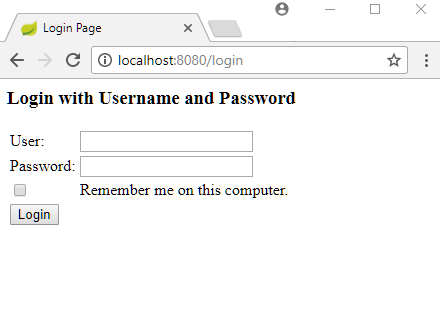
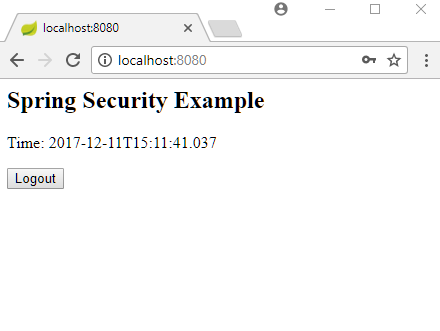

# Remember-Me Authentication using Persistent Token

**Note**: I can't make this example work.

In last example, we saw how to implement basic remember-me functionality using `TokenBasedRememberMeServices`. The problem with that method is; if a hacker gets the access to the cookie token then he can also access the application. To avoid that we can implement a more secure mechanism i.e. by using `PersistentTokenBasedRememberMeServices` which makes use of a database table to persist the username, a token (a random number) and a series identifier (unique to a series of remember-me logins till the remember-me period expires). This is to keep track of invalid logins. The combination of the token and series identifier is also persisted in a cookie on client browser. Let's understand how it works with an example.

## Java Config class

```java
@Configuration
@EnableWebSecurity
@ComponentScan
public class AppConfig extends WebSecurityConfigurerAdapter {

  protected void configure(HttpSecurity http) throws Exception {
      http.authorizeRequests()
          .anyRequest().authenticated()
          .and()
          .formLogin()
          .and()
          .rememberMe()
          .rememberMeCookieName("example-app-remember-me")
          .tokenRepository(persistentTokenRepository())
          .tokenValiditySeconds(24 * 60 * 60);
  }

  @Bean
  public PersistentTokenRepository persistentTokenRepository() {
      JdbcTokenRepositoryImpl repo = new JdbcTokenRepositoryImpl();
      repo.setDataSource(appDataSource());
      return repo;
  }

  @Bean
  public DataSource appDataSource() {
      return new EmbeddedDatabaseBuilder()
              .setType(EmbeddedDatabaseType.H2)
              .addScript("persistent_login_table.sql")
              .build();
  }

  @Override
  public void configure(AuthenticationManagerBuilder builder)
          throws Exception {
      BCryptPasswordEncoder passwordEncoder = new BCryptPasswordEncoder();
      builder.inMemoryAuthentication()
             .passwordEncoder(passwordEncoder)
             .withUser("joe")
             .password(passwordEncoder.encode("123"))
             .roles("ADMIN");
  }
}
```

As seen above `rememberMe()` registered a token repository which is needed to store the token info in the database table. In this example, we are using `JdbcTokenRepositoryImpl`. Also we configured a password encoder for in-memory authentication which is also needed for this method.

## The database table

The following table is needed for this method to work:

**src/main/resources/persistent_login_table.sql**

```sql
create table PERSISTENT_LOGINS (
username varchar(64) not null,
series varchar(64) primary key,
token varchar(64) not null,
last_used timestamp not null
);
```

## Controller

```java
@Controller
public class ExampleController {

  @RequestMapping("/")
  public String handleRequest(ModelMap map) {
      map.addAttribute("time", LocalDateTime.now().toString());
      return "my-page";
  }
}
```

## Post Login page

**src/main/webapp/WEB-INF/views/my-page.jsp**

```jsp
<html lang="en">
<body>
 <h2>Spring Security Example</h2>
 <p>Time: ${time}</p>
  <form action="/logout" method="post">
     <input type="hidden"
            name="${_csrf.parameterName}"
            value="${_csrf.token}"/>
  <input type="submit" value="Logout">
</form>
</body>
</html>
```

## Output

First access:



After authentication with remember-me checked:



## How it works?

To understand the persistent token concept, let's implement a MVC interceptor which will print what data is being persisted in 'PERSISTENT_LOGINS' table during user access.

```java
public class PrintDbInterceptor extends HandlerInterceptorAdapter {
  @Autowired
  private DataSource appDataSource;

  @PostConstruct
  public void init() {
      printPersistentLoginTable("On startup");
  }

  @Override
  public void afterCompletion(HttpServletRequest request,
                              HttpServletResponse response,
                              Object handler,
                              @Nullable Exception ex) throws Exception {
      System.out.println("Session id: " + request.getSession().getId());
      printPersistentLoginTable("After Completion");
  }

  private void printPersistentLoginTable(String msg) {
      System.out.printf("-- %s --%n", msg);
      JdbcTemplate jdbcTemplate = new JdbcTemplate(appDataSource);
      execSql(jdbcTemplate, "Select * from PERSISTENT_LOGINS");

  }

  public static void execSql(JdbcTemplate jdbcTemplate, String sql) {
      System.out.printf("'%s'%n", sql);
      jdbcTemplate.query(sql, rs -> {
          System.out.println();
          ResultSetMetaData metadata = rs.getMetaData();
          int columnCount = metadata.getColumnCount();
          for (int i = 1; i <= columnCount; i++) {
              String columnName = metadata.getColumnName(i);
              Object object = rs.getObject(i);
              System.out.printf("%s = %s%n", columnName, object);
          }
      });
      System.out.println("------------------");
  }
}
```

The above interceptor will print the table rows during startup and after each request completion.

### Registering the interceptor:

```java
@Configuration
@EnableWebMvc
public class MvcConfig extends WebMvcConfigurerAdapter {
  @Override
  public void addInterceptors(InterceptorRegistry registry) {
      registry.addInterceptor(theInterceptor());
  }

  @Bean
  public HandlerInterceptor theInterceptor() {
      return new PrintDbInterceptor();
  }

  @Override
  public void configureViewResolvers(ViewResolverRegistry registry) {
      registry.jsp("/WEB-INF/views/", ".jsp");
  }
}
```

### Setting HTTP session expire interval

Let's also set the HTTP Session expire interval to 30 seconds, so that we can watch what happens after session expires:

```java
package com.logicbig.example;

import javax.servlet.annotation.WebListener;
import javax.servlet.http.HttpSessionEvent;
import javax.servlet.http.HttpSessionListener;

@WebListener
public class SessionListener implements HttpSessionListener {

  @Override
  public void sessionCreated(HttpSessionEvent event) {
      System.out.println("----\nsession created\n------");
      event.getSession().setMaxInactiveInterval(30);
  }

  @Override
  public void sessionDestroyed(HttpSessionEvent event) {
      System.out.println("----\nsession destroyed\n------");
  }
}
```

### Output

In the following output, we have filtered Spring internal logs.

```apache
On startup:

-- On startup --
'Select * from PERSISTENT_LOGINS'
------------------
There are no rows in the table.

Following logs shows a sequence of first URL access, successful login, the subsequent session expiration (each after a wait of 30 secs) and then refreshing browser:

----
session created
------
Session id: DB7B8C750D3E68697DF3629BB9BFF9B5
-- After Completion --
'Select * from PERSISTENT_LOGINS'

USERNAME = joe
SERIES = W8d93LcLgjoIFk2u4ElBbQ==
TOKEN = LYuLWAbmJhi3P1ELmF9HBg==
LAST_USED = 2017-12-11 14:14:07.58
------------------
----
session destroyed
------
----
session created
------
Session id: 4B852FE911338F89FD9DB8EF18A6A214
-- After Completion --
'Select * from PERSISTENT_LOGINS'

USERNAME = joe
SERIES = W8d93LcLgjoIFk2u4ElBbQ==
TOKEN = iaSyWAUwaEijqgcZLNEuPg==
LAST_USED = 2017-12-11 14:14:58.307
------------------
----
session destroyed
------
----
session created
------
Session id: 627DAA1A6B337760680AFEF7503F9C7D
-- After Completion --
'Select * from PERSISTENT_LOGINS'

USERNAME = joe
SERIES = W8d93LcLgjoIFk2u4ElBbQ==
TOKEN = b+cftzoO6sU38iV15Q+P2A==
LAST_USED = 2017-12-11 14:15:57.666
------------------
```

As seen in above output, a new TOKEN value is issued after each HTTP session expiration + refreshing the page. All this time the SERIES identifier remains the same. Also per remember-me functionality, after refreshing an expired session does not require the user to login again.

Now log out so that the remember-me sequence will end (same thing happens when cookie expires, per our settings in AppConfig it will expire after 24 hours). On login again:

```apache
----
session created
------
Session id: 3C8816B391362A45F4FD66E6D6DEEF09
-- After Completion --
'Select * from PERSISTENT_LOGINS'

USERNAME = joe
SERIES = weBrlxLUSNLPj/hkaXqllQ==
TOKEN = YYMMvmoj+D/Cplqaz7RwEQ==
LAST_USED = 2017-12-11 14:16:14.143
------------------
```

As seen above, both a new SERIES value and a new TOKEN value are issued.

Now assume, during an active SERIES of remember-me lifecycle, someone hacks the cookie (which has the combination of SERIES and TOKEN) and accesses the same web application. The server side still cannot identify that someone else is accessing and will issue a new TOKEN (keeping SERIES same). The logic looks at the TOKEN in the request cookie and generates a next sequential TOKEN (this generation is also dependent on a particular SERIES value). Now if the valid user logs in, he will provide an old TOKEN corresponding to the same SERIES id. At this moment the server side will recognize a gap in the values of TOKEN and will invalidate all remember me sessions for the user and issue a hard security alert. More details can be found [here](https://docs.spring.io/spring-security/site/docs/5.0.0.BUILD-SNAPSHOT/reference/htmlsingle/#remember-me-persistent-token) (visit the link provided there).