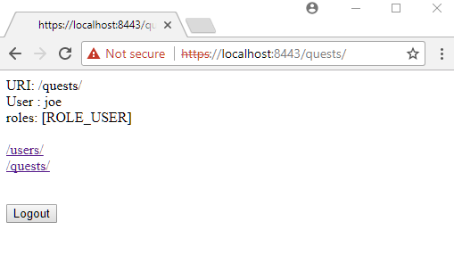

# HTTP/HTTPS Channel Security

<p style="color:red"><b>Note</b>: I cannot make the login to work. It keeps complaining incorrect credential.</p>

Spring Security supports both HTTP and HTTPS. In our application, we can specify particular URL pattern which can only be accessed over HTTPS. That means even if a user attempts to access those URLs using HTTP, it will be redirected to the HTTPS.

## Java Config class

```java
@Configuration
@EnableWebSecurity
@EnableWebMvc
@ComponentScan
public class AppConfig extends WebSecurityConfigurerAdapter {

  @Override
  protected void configure(HttpSecurity http) throws Exception {
      http.authorizeRequests()
          .antMatchers("/users/**").hasRole("USER")
          .antMatchers("/quests/**").permitAll()
          .anyRequest().authenticated()
          .and()
          .formLogin()
          .and()
          //following enables https for the specified URL pattern
          .requiresChannel().antMatchers("/users/**").requiresSecure();
  }

  @Override
  public void configure(AuthenticationManagerBuilder builder)
          throws Exception {
      builder.inMemoryAuthentication()
             .withUser("joe")
             .password(passwordEncoder().encode("123"))
             .roles("USER");
  }

  @Bean
  public PasswordEncoder passwordEncoder() {
      return new BCryptPasswordEncoder();
  }

  @Bean
  public ViewResolver viewResolver() {
      InternalResourceViewResolver vr = new InternalResourceViewResolver();
      vr.setPrefix("/WEB-INF/views/");
      vr.setSuffix(".jsp");
      return vr;
  }
}
```

## Controller

```java
@Controller
public class MyController {

  @RequestMapping(value = {"/users/**","/quests/**"})
  public String handleRequest(HttpServletRequest request, Model model) {
      Authentication auth = SecurityContextHolder.getContext()
                                                 .getAuthentication();
      model.addAttribute("uri", request.getRequestURI())
           .addAttribute("user", auth.getName())
           .addAttribute("roles", auth.getAuthorities());
      return "my-page";
  }
}
```

## View

**src/main/webapp/WEB-INF/views/my-page.jsp**

```jsp
<%@ taglib prefix="c" uri="http://java.sun.com/jsp/jstl/core"%>
<html lang="en">
<body>
 <p>URI: ${uri} <br/>
 User :  ${user} <br/>
 roles:  ${roles} <br/><br/>
 <a href="http://localhost:8080/users/">/users/</a><br/>
 <a href="http://localhost:8080/quests/">/quests/</a><br/><br/>
 </p>
 <form action="/logout" method="post">
     <input type="hidden"
            name="${_csrf.parameterName}"
            value="${_csrf.token}"/>
  <input type="submit" value="Logout">
</form>
</body>
</html>
```

As seen above, both links' href attributes are specified with 'http'. Clicking on /users/, however, will be redirected to 'https' per our Java config.

## Configuring tomcat to use HTTPS

### Creating a Keystore

To Create a keystore file to store the server's private key and self-signed certificate use following command:

```powershell
keytool -genkey -noprompt -alias <your-alias> -keyalg RSA -keystore <your-file-name> -keypass <your-password>
    -storepass <your-password> -dname "CN=<your-cert-name>, OU=<your-organization-unit>, O=<your-organization>,
    L=<your-location>, ST=<state>, C=<two-letter-country-code>"
```

For example, I created the keystore as:

```
C:\my-cert-dir> keytool -genkey -noprompt -alias tomcat-localhost -keyalg RSA -keystore localhost-rsa.jks -keypass 123456 -storepass 123456 -dname "CN=tomcat-cert, OU=Dev, O=bns, L=Toronto, ST=ON, C=CA"
```

Note that `keytool` comes with JDK (In this example JDK 1.8 is used). With this tool, we can manage a keystore (database) of cryptographic keys and trusted certificates etc.

Above example command will create a file `localhost-rsa.jks` under `C:\my-cert-dir`.

### Configuring SSL HTTP/1.1 Connector

Add followings in `<tomcat-dir>\conf\server.xml`

```XML
<Server ...>
 ....
   <Service name="Catalina">
     .....
      <Connector
         protocol="org.apache.coyote.http11.Http11NioProtocol"
         port="8443" maxThreads="200"
         scheme="https" secure="true" SSLEnabled="true"
         keystoreFile="C:\my-cert-dir\localhost-rsa.jks"
         keystorePass="123456"
         clientAuth="false" sslProtocol="TLS"/>
     .....
   </Service>
</Server>
```

## Output

Entering 'localhost:8080/quests/' in the address bar:


Clicking on '/users/' will be redirected to 'https' and as we have configured this URL to be accessed only by 'USER' role, login form will be shown at first access:


Note that Chrome shows 'Not secure' warning for self-signed certificate. For a real production application, we should get the certificate from a [certificate authority](https://en.wikipedia.org/wiki/Certificate_authority).

Entering valid user/password and clicking on 'Login' button:


Clicking on /quests/:


'/quests/' can also be accessed via https. Entering 'https://localhost:8443/quests/' in the address bar:

