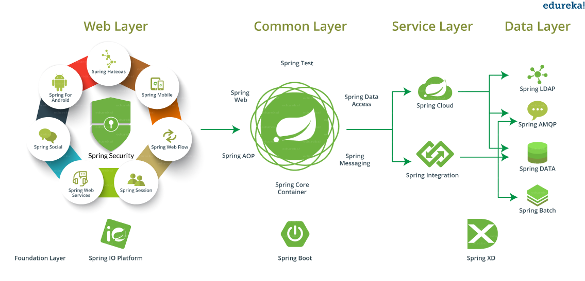

# Spring Framework

## Ecosystem

## Modules

1. Core Container

	1. Core: IoC (Inversion of Control) and Dependency Injection

	2. Bean: BeanFactory

	3. Context: A medium to access any defined and configured object

	4. Spring Expression Languages (SpEL): Querying and manipulating an object graph at runtime

2. Data Access/Integration

	1. JDBC: eliminating boilplate code required for Java JDBC

	2. ORM: Code portability regardless of data access technologies

	3. OXM: Conversion between objects and XML

	4. JMS: Enhanced Java Messaging Service

	5. Transaction: Transaction management

3. Web

	1. Web: Servlet listeners, web applicatin context

	2. Web-Servlet: MVC based web application

	3. Web-Socket: Two-way communication between client and server web applications

	4. Web-Portlet: MVC-Portlet

4. AOP: Address cross-cutting concerns

5. Instrumentation: Class instrumentation support and class loader implementations

6. Test: JUnit or TestNG support

## Tutorials 

### [01 Spring Core](01-core/README.md)
### [02 Spring Data Access With JDBC](02-jdbc/README.md)
### [03 Spring ORM](03-orm/README.md)
### [04 Spring MVC](04-mvc/README.md)
### [05 Spring Boot](05-boot/README.md)
### [06 Spring Integration](06-integ/README.md)
### [07 Spring Security](07-security/README.md)
### [08 Spring Webflux](08-webflux/README.md)
